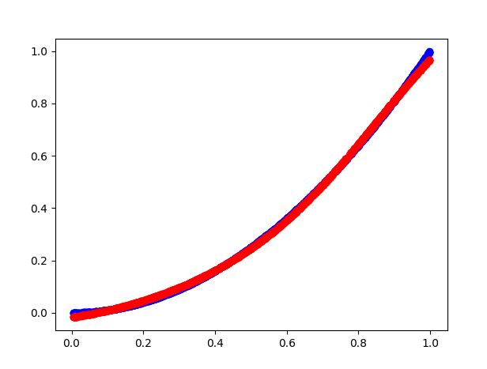
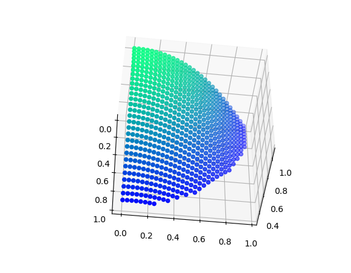

# NeuralNetwork

This is a simple neural network I wrote from scratch with numpy. With a few nodes it can approximate 2D functions, such as a parabola, and 3D functions, such as a sphere. 

This is my writeup on the theory behind the neural network, including forward propagation, backward propagation, activation functions, and loss functions. It also discusses how I implemented this in code. 
[Neural Network Writeup](Neural_Network_Math.pdf)
